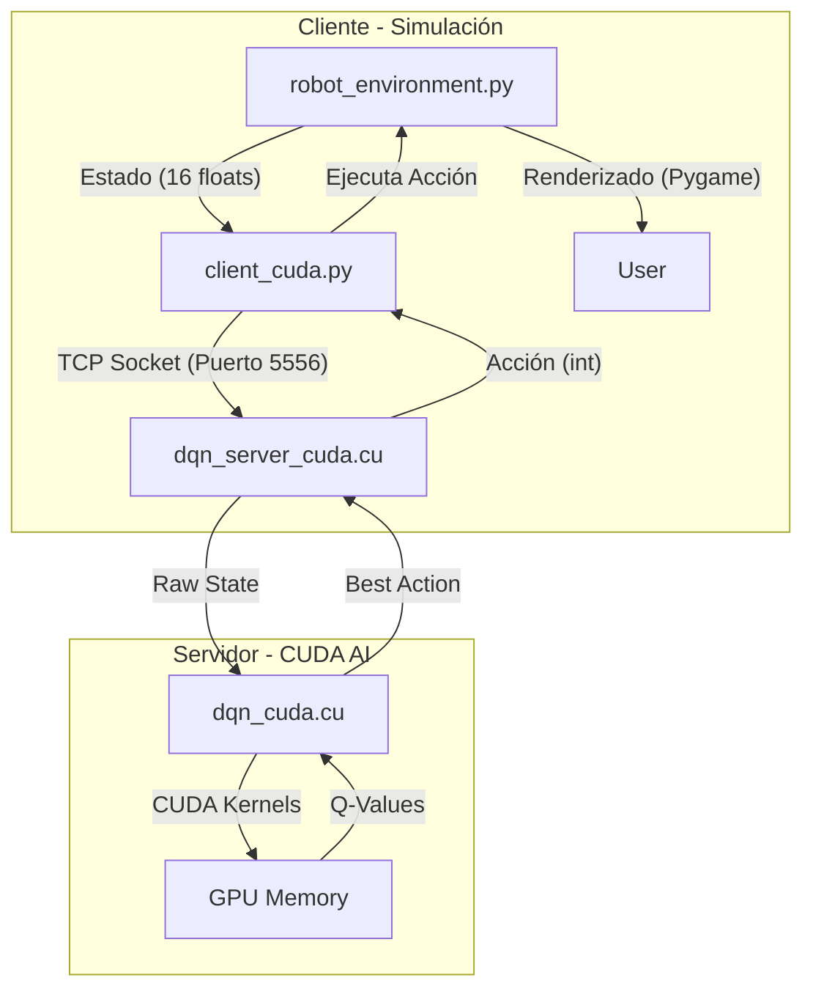

# Documentación Técnica: Proyecto DQN en Jetson Xavier

**Fecha:** 2025-12-19
**Versión:** 1.0
**Autor:** Antigravity (Assistant)

---

## 1. Resumen Ejecutivo

Este documento proporciona un análisis técnico detallado del proyecto de aprendizaje por refuerzo (Deep Q-Network) diseñado para ejecutarse en una arquitectura distribuida entre una laptop (simulación/cliente) y un NVIDIA Jetson Xavier (inferencia/servidor).

**Estado Actual:** El proyecto tiene una arquitectura funcional de cliente-servidor y una implementación base de DQN en CUDA. Sin embargo, **el sistema de entrenamiento está incompleto**, lo que impide que el agente aprenda.

---

## 2. Arquitectura del Sistema

El sistema utiliza un modelo **Distributed Inference** donde la simulación ligera corre en CPU (Laptop) y el procesamiento pesado de redes neuronales corre en GPU (Jetson Xavier).



### 2.1 Componentes Principales

| Componente | Lenguaje | Ubicación | Responsabilidad |
| :--- | :--- | :--- | :--- |
| **Simulación** | Python | `client/robot_environment.py` | Gestiona la física, colisiones, sensores y visualización Pygame. |
| **Cliente TCP** | Python | `client/client_cuda.py` | Puente de comunicación. Serializa estados y deserializa acciones. |
| **Servidor TCP** | C++ | `jetson_files/dqn_server_cuda.cu` | Daemon que escucha peticiones, gestiona memoria y llama a funciones CUDA. |
| **Motor DQN** | CUDA C | `jetson_files/dqn_cuda.cu` | Implementación de bajo nivel de la red neuronal, kernels y lógica (incompleta) de entrenamiento. |

---

## 3. Análisis Detallado del Código

### 3.1 Cliente (Python)

#### `client/robot_environment.py`
Define el mundo grid (cuadrícula).
-   **Estado (Input Grid)**: El robot percibe el entorno a través de un vector de **15 valores**:
    -   Posición Robot (x, y) normalizada.
    -   Posición Objetivo (x, y) normalizada.
    -   Distancia al objetivo y al obstáculo más cercano.
    -   Ángulo hacia el objetivo.
    -   **8 Sensores de proximidad**: Raycasting en 8 direcciones (N, NE, E, SE, S, SO, O, NO) para detectar obstáculos.
-   **Acciones**: 8 posibles movimientos (direcciones cardinales y diagonales).
-   **Recompensa**: 
    -   `+` por acercarse al objetivo.
    -   `-` por alejarse.
    -   `+100` por llegar.
    -   `-15` por colisión.

#### `client/client_cuda.py`
Maneja el bucle principal.
-   **Clase `CUDAClient`**: Abstrae la conexión socket.
-   **Protocolo**:
    -   Envío: `STATE:v1,v2,...,v15`
    -   Recepción: `action_idx,epsilon_val`
    -   Fin episodio: `EPISODE_END` -> Recibe `OK`
    -   Guardado: `SAVE` -> Recibe `SAVED`

### 3.2 Servidor (CUDA C)

#### `jetson_files/dqn_server_cuda.cu`
Es el punto de entrada (`main`) del ejecutable en el Jetson.
-   Inicializa la red neuronal con `create_simple_network()`.
-   Entra en un `while(1)` para aceptar conexiones.
-   Procesa comandos:
    -   `STATE:`: Parsea CSV, copia a GPU, ejecuta `simple_forward`, selecciona acción (epsilon-greedy), devuelve respuesta.
    -   `EPISODE_END`: Reduce el valor de epsilon (decay).

#### `jetson_files/dqn_cuda.cu`
Contiene la "magia" matemática en CUDA puro.
-   **Estructuras**: `NeuralNetwork` (punteros a memoria GPU para W1, b1, etc.).
-   **Kernels**:
    -   `matmul_kernel`: Multiplicación de matrices básica para capas densas.
    -   `relu_kernel`: Función de activación.
    -   `huber_loss_kernel`: Cálculo de error (usado teóricamente para entrenamiento).
-   **Red Neuronal**:
    -   Entrada: 15 neuronas.
    -   Ocultas: 2 capas de 128 y 64 neuronas.
    -   Salida: 8 neuronas (Q-values para cada acción).

---

## 4. Análisis de Deficiencias Críticas (Critical Gap Analysis)

> [!CAUTION]
> **PROBLEMA CRÍTICO: EL ENTRENAMIENTO NO FUNCIONA**

Se ha detectado que el sistema actual es incapaz de aprender. Aunque ejecuta inferencia, **el bucle de retroalimentación necesario para el Aprendizaje por Refuerzo está roto**.

### 1. Falta de Retroalimentación (Reward Missing)
El cliente (`client_cuda.py`) obtiene la recompensa del entorno (`reward`) y el nuevo estado (`next_state`) después de moverse, pero **NUNCA envía estos datos al servidor**.
```python
# client_cuda.py (Línea 120-123)
next_state, reward, done, info = env.step(action)
# El código continúa sin enviar 'reward' ni 'next_state' al Jetson.
# Simplemente pide la siguiente acción para el 'next_state'.
```
Sin recibir la recompensa, el servidor no tiene señal para saber si una acción fue buena o mala.

### 2. Backpropagation No Implementado
En el archivo `jetson_files/dqn_cuda.cu`, la función `train_step` existe pero está incompleta:
```c
// L. 511
// TODO: Implementar backward pass y actualización de pesos
// (Esto requeriría implementar autograd en CUDA, que es muy complejo)
```
Incluso si el servidor recibiera las recompensas, no tiene el código matemático (cálculo de gradientes) para actualizar los pesos de la red neuronal. Actualmente solo calcula el error (Loss) pero no hace nada con él.

**Consecuencia**: El "entrenamiento" actual es simplemente una ejecución con una política aleatoria que se vuelve determinista (pero no inteligente) a medida que baja el epsilon.

---

## 5. Guía de Instalación y Uso

A pesar de las limitaciones de entrenamiento, el sistema puede ejecutarse para verificar conectividad y rendimiento de inferencia.

### Requisitos
-   **Laptop**: Python 3.x, `pygame`, `numpy`.
-   **Jetson Xavier**: JetPack (CUDA Toolkit instalado), `gcc`, `make`.

### Pasos de Despliegue

1.  **En Jetson (Servidor)**:
    ```bash
    # 1. Copiar archivos
    scp -r jetson_files/* jetson@<IP>:~/dqn_cuda_project/

    # 2. Compilar
    ssh jetson@<IP>
    cd ~/dqn_cuda_project
    make

    # 3. Ejecutar servidor
    ./bin/dqn_server_cuda
    ```

2.  **En Laptop (Cliente)**:
    ```bash
    cd client
    # Instalar dependencias
    pip install pygame numpy

    # Ejecutar cliente
    python3 client_cuda.py --host <IP_JETSON>
    ```

---

## 6. Hoja de Ruta para Reparación (Roadmap)

Para convertir este prototipo en un sistema funcional, se deben realizar las siguientes tareas:

1.  **Fase 1: Protocolo (Urgente)**
    -   Modificar `client_cuda.py` para enviar `(state, action, reward, next_state, done)` al final de cada paso, o acumularlos y enviarlos por lotes.
    -   Modificar `dqn_server_cuda.cu` para recibir y almacenar estos datos en el `ReplayBuffer`.

2.  **Fase 2: Motor de Entrenamiento (Complejo)**
    -   **Opción A (Recomendada)**: Reemplazar la implementación de red neuronal "a mano" en CUDA por **LibTorch C++ (PyTorch C++ API)**. Esto provee Autograd (backpropagation automático) gratis y es altamente optimizado para Jetson.
    -   **Opción B (Dura)**: Implementar manualmente los kernels de *backward pass* para:
        -   `d_ReLU`
        -   `d_MatMul` (A^T * dY)
        -   Optimizador SGD/Adam manual.

3.  **Fase 3: Sincronización**
    -   Asegurar que el servidor entrene (`train_step`) periódicamente (ej. cada N pasos) y no solo haga inferencia.

---

**Fin del Documento Técnico**
